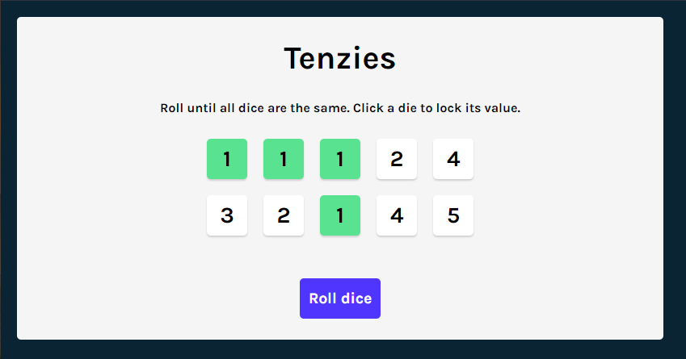
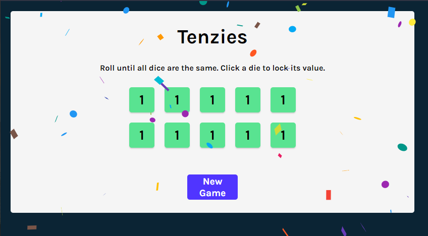

# ReactDemo5-TenziesApp

 

 

This repo contains a tenzies game application, made with react.

The game functions in the following way:
- Random numbers are initally assigned to all die
- If the user clicks on a die it toggles the die being locked
- When the roll dice button is selected; all the unlocked die will be given new random values
- When all the dice have been locked with the same value, the user will win
- The user can now use the button to reset the game and play again

It is made as part of the following course:

[FreeCodeCamp's React Course 2022](https://www.youtube.com/watch?v=bMknfKXIFA8&list=WL&index=1)
